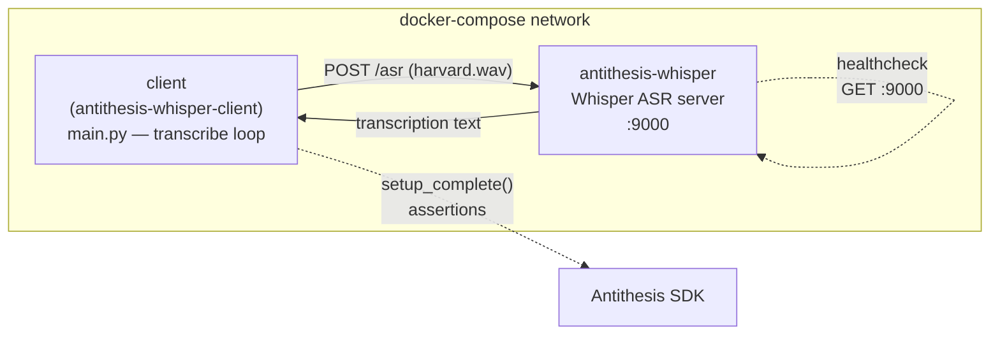

# openai-whisper

An [Antithesis](https://antithesis.com) test harness for the
[OpenAI Whisper ASR web service](https://github.com/ahmetoner/whisper-asr-webservice).
It runs the Whisper ASR server alongside a client that continuously submits
audio for transcription, instrumented with the Antithesis SDK for deterministic
testing.

## Layout

| Path | Description |
| --- | --- |
| `whisper/` | Dockerfile for the Whisper ASR server. Pre-downloads the `medium` model and runs inference on CPU. |
| `client/` | Python client that POSTs `harvard.wav` to the server's `/asr` endpoint in a loop, plus its Dockerfile. |
| `config/` | `docker-compose.yaml` wiring the two services together, the `.env` file with the image registry, and a `scratch` Dockerfile that packages both for Antithesis. |
| `Makefile` | Build, run, and push targets. |

## Topology



- The `client` waits on the `antithesis-whisper` healthcheck (`depends_on:
  service_healthy`) before starting.
- Both containers share the compose network; the client reaches the server by
  its hostname `antithesis-whisper`.
- The client reports lifecycle and assertion events to Antithesis via the SDK.

## How it works

- **`antithesis-whisper`** — the ASR server, exposed on port `9000`. A
  healthcheck polls `http://localhost:9000` until the server is ready.
- **`client`** — waits for the server to become healthy, calls
  `setup_complete()` to signal Antithesis that the system is ready, then
  repeatedly transcribes `harvard.wav` every 10 seconds.

The client takes a single run-length argument (in seconds, or `inf` to run
forever). The compose file launches it with `inf`.

## Usage

Build the images:

```sh
make whisper   # build the ASR server image
make client    # build the client image
make config    # build the config image (compose + .env)
```

Run the harness locally with docker-compose:

```sh
make run       # tears down any existing run, then `up`
make down      # tear down and remove volumes
```

Push all images to the registry (requires customer credentials):

```sh
make push
```

## Configuration

The image registry is set in `config/.env`:

```
REPOSITORY=us-central1-docker.pkg.dev/molten-verve-216720/honey-pwhale-repository
```

The Whisper server is configured via environment variables in
`whisper/Dockerfile`:

- `ASR_MODEL=medium`
- `ASR_MODEL_PATH=/app/models`
- `ASR_DEVICE=cpu`
